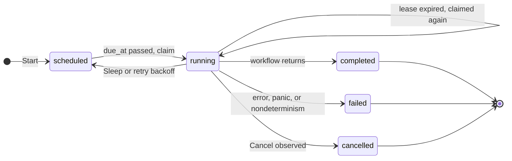

# stubborn

A Go library for workflows that survive crashes.

A workflow is an ordinary Go function.
Stubborn records the result of every step in Postgres or SQLite, so when the process dies (`kill -9`, OOM, a deploy, a power cut), any worker can pick the workflow up and continue after the last step that completed.
Retries with backoff, durable timers, idempotency keys, and crash recovery are part of the library.
There is no server: the database is the only shared component.

```go
func Transfer(r *stubborn.Run, in TransferInput) (Receipt, error) {
	hold, err := stubborn.Step(r, "hold", func(ctx context.Context) (HoldID, error) {
		return bank.Hold(ctx, in.From, in.Amount, stubborn.IdempotencyKey(ctx))
	})
	if err != nil {
		return Receipt{}, err
	}

	if err := r.Sleep(72 * time.Hour); err != nil {
		return Receipt{}, err
	}

	return stubborn.Step(r, "capture", func(ctx context.Context) (Receipt, error) {
		return bank.Capture(ctx, hold, stubborn.IdempotencyKey(ctx))
	}, stubborn.Retry{Attempts: 20, Initial: time.Second, Max: 5 * time.Minute})
}

func main() {
	ctx := context.Background()
	store, err := sqlite.Open(ctx, "stubborn.db")
	if err != nil {
		log.Fatal(err)
	}
	eng := stubborn.New(store, stubborn.Options{})
	transfer := stubborn.Register(eng, "transfer", Transfer)

	go eng.Run(ctx)

	h, err := transfer.Start(ctx, "transfer-42", TransferInput{From: "alice", Amount: 100})
	if err != nil {
		log.Fatal(err)
	}
	receipt, err := h.Result(ctx)
}
```

The process can exit during those 72 hours.
Until the timer is due, the run is one row in the database, and then any worker running `eng.Run` picks it up.

**Status: design.** No code yet.
Every milestone in the roadmap ends with a library that works, so the project can stop at any of them.

Temporal exists and is what to use in production.
The point of stubborn is to build the core ideas by hand (replay, leases and fencing tokens, idempotency, crash consistency), with no kernel work.

---

## Guarantees

These are the promises the tests hold the library to.
"Once" means once in the database: nothing can make an arbitrary call to the outside world happen exactly once.

| Thing | Guarantee |
|---|---|
| Run ID | Names at most one run, ever. `Start` with an existing ID returns that run (or `ErrIDConflict` if the workflow or input differ), so `Start` is safe to retry. |
| Workflow function | Runs many times: every resume replays it from the top. Everything it does outside steps must be deterministic. |
| Step body | Runs at least once per attempt. It runs again if its worker dies after the body returns but before the result is committed, or if the worker loses its lease mid-step. |
| Step result | Committed once per position in the run and never changed. Every replay sees the same value or the same error. |
| `IdempotencyKey(ctx)` | Identical every time the same step executes, across attempts, crashes and workers. Passing it to the outside world turns an at-least-once body into an effectively-once effect. |
| `TxStep` | The body's writes to the stubborn database commit exactly once, in the same transaction as its checkpoint. |
| `Sleep(d)` | Never wakes early. Wakes late only by scheduling delay: the poll interval, plus however long every worker is busy or down. |
| Retries | Attempt counts and backoff deadlines are recorded, so a crash neither resets nor shortens them. |

The idempotency key is per step, not per attempt, because "same logical operation" is what deduplication needs.
If a downstream API caches failed responses under a key, build a per-attempt key from `IdempotencyKey(ctx)` and `Attempt(ctx)`.

## How it works

### Recovery is replay

There is no special recovery path.
Resuming after a sleep, after a retry backoff, and after a crash are the same operation: claim the run, load its checkpoints, and call the workflow function from the top.
Every durable call (`Step`, `Sleep`) takes the next sequence number in the run.
If a checkpoint exists for that number, the call returns the recorded result and does nothing else.
The first call without a checkpoint is the frontier, and execution continues live from there.

The `Transfer` workflow above, with one crash:

```
claim 1: worker A, epoch 1
  Step "hold"      no checkpoint: run body, commit #0
  Sleep 72h        no checkpoint: commit #1 with wake_at = now + 72h, suspend
claim 2: worker A, epoch 2, 72 hours later
  Step "hold"      #0 recorded: return it, skip body
  Sleep 72h        #1 recorded, wake_at passed: return
  Step "capture"   no checkpoint: run body ... SIGKILL
claim 3: worker B, epoch 3, after A's lease expired
  Step "hold"      #0 recorded: return it, skip body
  Sleep 72h        #1 recorded, wake_at passed: return
  Step "capture"   no checkpoint: run body, commit #2
  return           commit output, run completed
```

Claims 2 and 3 are the same code path.
Only the reason the run became due differs: a timer in one case, an expired lease in the other.
The body of `capture` ran twice, with the same idempotency key both times, which is how the bank tells that the second call is a retry.

Replay costs one query to load the run's checkpoints, plus decoding them.
It is linear in the number of steps already completed.

### Committing a step

```
Step(r, name, fn):
    seq := r.nextSeq()
    cp, found := r.history[seq]
    if found && cp.name != name:      fail the run with ErrNondeterminism
    if found && cp.terminal:          return decode(cp)                   // replay
    if found && cp.wakeAt > r.dbNow:  suspend until cp.wakeAt             // backoff not over
    attempt := cp.attempts + 1                                            // 1 when not found
    v, err := fn(stepCtx)
    if err == nil:                    commit done(v)
    elif retryable(err, attempt):     commit retrying(attempt, err, wakeAt = dbNow + backoff); suspend
    else:                             commit failed(err)
    return decode(committed)
```

`stepCtx` carries the idempotency key `<run id>/<seq>` and the attempt number, and is cancelled if the worker loses its lease.
A panic in `fn` is recovered and becomes `err`.
Every commit is fenced (see below), and nothing reaches workflow code until its commit succeeds.

Decoding what was committed, even on the first run, is deliberate.
If the first run returned the in-memory value and replays returned the decoded one, anything the codec loses (unexported fields, the monotonic reading in a `time.Time`, nil versus empty slices) would make the first run and its replays behave differently.
Round-tripping every time removes that class of bug, and makes encoding mistakes show up on the first run in development instead of after the first crash in production.

Errors follow the same rule.
A step error is persisted as a `*stubborn.StepError` with a message and an optional code, and that is what workflow code receives, on the first run and on every replay.
Workflow code branches on `stubborn.ErrorCode(err)`, not on `errors.Is` against an in-memory sentinel, because only what is persisted survives a crash.

### Suspension: timers

A run that has to wait does not hold a goroutine, a lease, or memory while it waits.
`Sleep(d)` commits a checkpoint with `wake_at = now + d`, using the database clock, and in the same transaction sets the run back to `scheduled` with `due_at = wake_at` and releases the lease.
Then it unwinds the workflow goroutine.
When `wake_at` passes, any worker claims the run and replays it, and `Sleep` finds its checkpoint, sees that the wake time has passed, and returns.
A run that sleeps for a month is one row.

The wake time is computed once and read back on every replay.
Recomputing it as `now + d` during replay would push it forward every time, and the run would never wake.
The same rule covers retry backoff (including its random jitter) and `stubborn.Now(r)`, which is a step that records `time.Now()`.

Unwinding uses `runtime.Goexit`, not `panic`.
`Goexit` runs deferred calls, but `recover()` cannot stop it, so a workflow that recovers panics cannot swallow a suspension by accident.
Durable calls made from deferred functions while unwinding are refused with an error.

### Retries

Steps do not retry unless asked, because retrying a body that is not idempotent should be a decision, not a default.
`stubborn.Retry{Attempts, Initial, Max, Multiplier}` retries with exponential backoff and full jitter.
A failed attempt commits its attempt count, error and next attempt time, then suspends the run exactly like a `Sleep`, so a crash during a ten-minute backoff neither restarts the count nor cuts the wait short.
`stubborn.Permanent(err)` stops retrying immediately.
`stubborn.Timeout(d)` bounds each attempt through its context.

### Leases and fencing

A worker claims a run in a single statement that sets `status = 'running'`, `owner`, `due_at = now + lease`, and `epoch = epoch + 1`.
While the run executes, the worker heartbeats to push `due_at` forward.
If the worker dies, the heartbeats stop, `due_at` passes, and the run becomes claimable again: crash recovery is the claim query noticing an expired lease.

The epoch is a fencing token.
Every write a worker makes for a run (checkpoint, suspend, complete) first checks, inside the same transaction, that the run's epoch is still the one it claimed with.
A worker that was paused rather than dead (a long GC pause, `SIGSTOP`, a closed laptop lid) and wakes up after another worker took over finds its writes rejected, and abandons the run.
It may still have executed a step body while it was out of date.
Fencing protects the database, not the outside world, which is why step bodies get idempotency keys.

A worker that cannot reach the database cannot heartbeat, so it has to assume its lease will lapse.
It cancels its step contexts and abandons its runs before the lease could have expired, measuring from when it sent the last successful heartbeat, not from when the reply arrived.

All absolute times (lease expiry, wake times) are computed by the database from durations the engine passes in.
Each claim also returns the database's current time, and the engine uses that, never the worker's clock, to decide whether a recorded wake time has passed.
Workers on different machines therefore never disagree about whether a lease has expired.

The claim on Postgres:

```sql
UPDATE stubborn.runs
SET    status = 'running', owner = $1, epoch = epoch + 1, due_at = now() + $2
WHERE  id = (
    SELECT id FROM stubborn.runs
    WHERE  status IN ('scheduled', 'running')
      AND  due_at <= now()
      AND  workflow = ANY($3)
    ORDER  BY due_at
    LIMIT  1
    FOR UPDATE SKIP LOCKED
)
RETURNING id, workflow, input, epoch, now();
```

SQLite has no `SKIP LOCKED` and does not need it: the same statement runs inside `BEGIN IMMEDIATE`, and SQLite's single writer makes claims exclusive.
`workflow = ANY($3)` restricts a worker to the workflows it has registered, so during a rolling deploy old workers do not claim and fail runs that only the new code knows how to execute.

### Storage

Two tables, in their own schema on Postgres and with a table prefix on SQLite, so they can live in the application's own database.
That placement is what makes `TxStep` possible.

`runs`

| Column | Meaning |
|---|---|
| `id` | Primary key. Chosen by the caller or generated. This is what makes `Start` idempotent. |
| `workflow` | Registered workflow name. |
| `input` | Encoded input. |
| `status` | `scheduled`, `running`, `completed`, `failed`, or `cancelled`. |
| `due_at` | When someone needs to look at this run next: the wake time while `scheduled`, the lease expiry while `running`. One column, one partial index, one claim query. |
| `owner` | Worker holding the lease. |
| `epoch` | Incremented on every claim. The fencing token. |
| `output`, `error` | Set once, together with the terminal status. |
| `created_at`, `updated_at` | |

`checkpoints`, primary key `(run_id, seq)`

| Column | Meaning |
|---|---|
| `kind` | `step` or `sleep`. |
| `name` | Step name, checked on replay to detect nondeterminism. |
| `status` | `done`, `failed`, or `retrying`. Only `retrying` rows are ever updated. |
| `output`, `error` | Encoded result. |
| `attempts` | Attempts so far. |
| `wake_at` | The sleep's wake time, or the next attempt time while `retrying`. |
| `epoch` | Epoch of the worker that wrote the row. Along a run these never decrease, and the torture test checks it. |

The life of a run:



SQLite runs in WAL mode with `synchronous=FULL`, so a commit survives power loss and not just process death.
Every SQLite write transaction uses `BEGIN IMMEDIATE`, because a deferred transaction that has to upgrade from read to write can fail with `SQLITE_BUSY` in a way `busy_timeout` does not retry.

## Rules for workflow code

Everything outside a step runs again on every replay, so it must make the same durable calls, in the same order, with the same names, every time.

- No `time.Now`, `rand`, environment variables, or I/O outside steps.
  Wrap them in a step; `stubborn.Now(r)` covers the common case.
- Do not let map iteration order decide which steps run.
  Go randomizes it.
- Make durable calls only from the workflow goroutine, never from goroutines it starts.
- Step names are part of a run's history.
  Renaming or reordering steps breaks runs that are in flight: they fail with `ErrNondeterminism` instead of silently doing the wrong thing.
  Ship incompatible changes under a new workflow name (`transfer.v2`) and let old runs drain.
- Keep step results small (IDs, not documents), because every replay decodes all of them.

## Invariants

The tests are organized around these, and a failing test names the invariant it caught.

1. A checkpoint is committed before workflow code sees its result.
2. Results and errors are round-tripped through the codec on the first run too.
3. Wake times, backoff delays, jitter and `Now` are computed once, recorded, and read back, never recomputed on replay.
4. Every write for a run is fenced by the epoch it was claimed with, and a rejected write abandons the run on that worker immediately.
5. Suspending commits its checkpoint and reschedules the run in one transaction, and completing commits the output and the terminal status in one transaction.
6. `done` and `failed` checkpoints, and terminal runs, are never modified.
7. Sequence numbers are allocated on the workflow goroutine in call order, and the recorded name must match on replay.
8. Absolute times come from the database clock, never from a worker's.
9. A worker that cannot heartbeat abandons its runs before its lease can expire.
10. A worker claims only runs of workflows it has registered.

## Testing

The library's claims are only as good as its crash tests, so the test plan is part of the design.

**Engine unit tests** run against an in-memory store inside `testing/synctest` bubbles.
Virtual time makes a 72-hour sleep or a 20-attempt backoff schedule finish instantly and deterministically.

**Store conformance suite** (`store/storetest`) is one suite run against the in-memory, SQLite and Postgres stores.
It covers claim exclusivity under concurrent claimers, reclaiming expired leases, rejecting stale epochs, idempotent `Start`, and immutability of terminal checkpoints.
A new store is correct when this suite passes.

**Kill tests** re-execute the test binary as a worker subprocess, `SIGKILL` it at a named failpoint in the commit path, restart it, and check the outcome.
Failpoints are compiled in only with `-tags failpoints`.

| Failpoint | State at the kill | Required outcome |
|---|---|---|
| `claim.after_commit` | Claimed, nothing executed | The lease expires and another worker finishes the run. |
| `step.after_body` | Body returned, nothing committed | The body runs again. |
| `step.after_commit` | Committed, workflow not yet continued | The body does not run again. |
| `suspend.after_commit` | Timer recorded, run rescheduled | The run wakes on time. |
| `complete.before_commit` | Output computed, not stored | The run finishes with the same output. |

**Zombie test**: `SIGSTOP` a worker for longer than its lease, let another worker take over, then `SIGCONT` it.
Every write the zombie attempts must be rejected, and it must abandon the run.

**Torture** (`cmd/torture`): several worker processes share one database while a chaos loop kills, restarts and pauses them at random.
Hundreds of workflows mix steps, sleeps, and steps that fail randomly.
Each step body appends a row to a raw `effects` table on every execution, and inserts its idempotency key into a deduplicated `ledger`.
At the end it checks that:

- every run completed with the output its input determines;
- every run has a contiguous sequence of checkpoints with non-decreasing epochs;
- `ledger` has exactly one row per step, while `effects` reports how many duplicate executions the crashes actually caused;
- no sleep resumed before its recorded wake time;
- no step exceeded its attempt limit.

The numbers go into this README at the end of milestone 5.

## Non-goals

Binding, because each one would be a project of its own.

- Not Temporal.
  No server or cluster, no other languages, no web UI.
  A library in your process, plus a database.
- No workflow versioning.
  In-flight runs whose code changed shape fail loudly with `ErrNondeterminism`; they are not migrated.
- No exactly-once calls to the outside world, because nobody can provide them.
  Bodies are at-least-once, and idempotency keys and `TxStep` are the tools for living with that.
- No parallel steps, child workflows, or signals (`r.Await("approved")`).
  Suspension makes all three natural extensions after the roadmap, not part of it.
- No continue-as-new.
  A run's history grows with its step count, so an unbounded loop should be a chain of runs.
- No cron, priorities, rate limits, or queues.
  Not a job system.
- Not tuned for throughput.
  Milestone 5 measures it, and nothing chases it.

## Layout

```
stubborn.go          Engine, Register, Start, Handle, Options               [plumbing]
run.go               Run: sequence numbers, history, replay, unwinding      [core]
step.go              Step, IdempotencyKey, Attempt, Now                     [core]
retry.go             Retry policy, backoff with jitter, Permanent           [core]
timer.go             Sleep, suspension                                      [core]
worker.go            claim loop, heartbeats, self-fencing, shutdown         [core]
codec.go             Codec interface, JSON codec, StepError                 [plumbing]
store/store.go       Store interface: the contract between engine and DB    [core]
store/memstore/      in-memory store for unit tests                         [plumbing]
store/sqlite/        SQLite store and embedded migrations                   [core]
store/postgres/      Postgres store (pgx) and embedded migrations           [core]
store/storetest/     conformance suite, run against every store             [plumbing]
internal/failpoint/  crash injection points, only with -tags failpoints     [plumbing]
cmd/stubborn/        CLI: list, inspect, cancel, retry                      [plumbing]
cmd/torture/         chaos harness and invariant checker                    [plumbing]
examples/            transfer (timer), flaky (retries), ledger (TxStep)
```

`[core]` marks where the understanding lives: replay, suspension, fencing, and the claim and commit SQL.
It is roughly 1,500 lines.
Warden's authorship rule (core typed by hand, plumbing delegated) does not apply here.
Any file, `[core]` included, can be written by hand or by an assistant, and each slice doc's design table records which.

## Development

- Go 1.26 on Linux, developed under WSL2 like warden.
- Keep the repository on the Linux filesystem, not under `/mnt/c`.
  SQLite's file locking is unreliable on drvfs, and the crash tests depend on it.
- SQLite through `modernc.org/sqlite` (pure Go, no cgo).
  Postgres through `pgx/v5`, running in Docker for tests.
- Module path `github.com/FreddieTheObserver/stubborn`.

Planned targets: `make test` (unit tests and SQLite), `make test-pg` (starts Postgres in Docker), and `make torture`.

## Roadmap

| # | Milestone | Stop here with |
|---|---|---|
| 1 | **Durable steps on SQLite.** `Register`, `Start`, `Result`, replay, codec round-trip, `StepError`, leases, epochs, heartbeats, idempotency keys, in-memory store, conformance suite, kill tests. | Workflows on one machine that survive `kill -9`. |
| 2 | **Durable timers.** `Sleep`, suspension with `Goexit`, `Now`. | Workflows that wait for days and survive restarts while waiting. |
| 3 | **Retries.** Retry policy, recorded attempts and jittered backoff, `Permanent`, panicking bodies, per-attempt timeouts. | Flaky dependencies that no longer fail workflows. |
| 4 | **Postgres and many workers.** pgx store, `SKIP LOCKED` claims, self-fencing, conformance suite on both databases, zombie test. | Horizontal scale on a real database. |
| 5 | **Torture.** Chaos harness, invariant checker, results published here. | Evidence instead of claims. |
| 6 | **`TxStep`.** Body and checkpoint in one transaction, on both stores. | Exactly-once writes when your data shares stubborn's database. |
| 7 | **Operating it.** CLI (`list`, `inspect`, `cancel`, `retry`), cancellation, graceful shutdown that releases leases, `LISTEN/NOTIFY` wakeups. | Something a side project could run on. |

Milestone 1 is done when this passes:

> **A three-step workflow, `SIGKILL`ed right after step 2 commits, resumes in a fresh process and runs only step 3.**

Everything after milestone 1 is additive.

## Open questions

1. **Short sleeps.**
   Should `Sleep` under about a second block in-process instead of suspending?
   It is faster, but it means two paths for one feature.
   Default: always suspend, until milestone 5 measures what that costs.
2. **Cancellation and compensation.**
   After `Cancel`, should durable calls fail fast, which is simple, or should the workflow be allowed to run compensating steps, which sagas need?
   Probably the latter, through an explicit `r.Cancelled()` check rather than every call failing.
3. **Retention.**
   When are finished runs deleted, and does deleting a run free its ID for reuse?

## Prior art

- **Temporal**, and Cadence before it: event-sourced replay with a server cluster.
  The reference design.
- **DBOS Transact**: a library that checkpoints steps in Postgres.
  The closest relative of stubborn.
- **Restate** and **Inngest**: the same idea, behind a server.
- Martin Kleppmann, [How to do distributed locking](https://martin.kleppmann.com/2016/02/08/how-to-do-distributed-locking.html): why leases need fencing tokens.
- The PostgreSQL documentation for `SELECT ... FOR UPDATE SKIP LOCKED`, the standard way to build a queue on Postgres.
