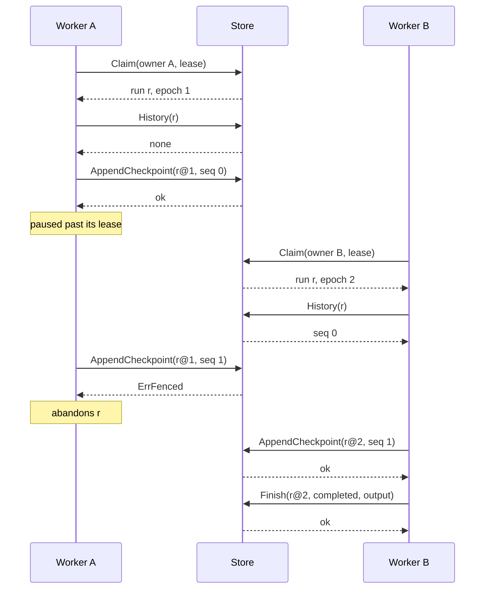

# 01: Store contract

Status: Done
Depends on: 00
Roadmap milestone: 1

## Scope

Delivers:

- `store.Store`, the interface between the engine and a database, covering what milestone 1 needs: creating runs, claiming them under a lease, heartbeating, reading a run's history, appending checkpoints, and finishing runs.
- Fencing as part of the contract: every write for a run carries a `store.Fence` (run ID and epoch), and the store rejects it with `ErrFenced` once the run has been claimed again or has finished.
- `store/memstore`, an in-memory store for the engine's unit tests in later slices.
- `store/storetest`, the conformance suite every store must pass, run here against memstore under `-race`.

Does not deliver (and where it goes):

- The engine: `Register`, `Start`, `Handle.Result`, the claim loop, replay, `Step`, the codec round trip, `StepError` and `IdempotencyKey`, tested on memstore inside synctest bubbles: slice 02 (replay).
- The heartbeat loop, step contexts cancelled on lease loss, and abandoning a run on `ErrFenced`: slice 03 (leases).
- The SQLite store passing this suite, with `modernc.org/sqlite`, embedded migrations, WAL and `BEGIN IMMEDIATE`: slice 04 (sqlite).
- Failpoints, the kill-test harness, the milestone 1 acceptance test, and moving the README internals into `ARCHITECTURE.md`: slice 05 (kill tests).
- The database's current time in a claim's result: milestone 2, where `Sleep` first needs it to decide whether a wake time has passed.
- Store methods and columns for later milestones, each added with the milestone that uses it: suspending a run, `kind` and `wake_at` (milestone 2), updatable `retrying` checkpoints and `attempts` (milestone 3), Postgres (milestone 4), a transaction handle for `TxStep` (milestone 6), cancellation and releasing leases on shutdown (milestone 7).

## Done when

- [x] `make check` runs the conformance suite against memstore under `-race`, and it passes (`TestConformance` in `store/memstore`).
- [x] Creating a run is idempotent: the same ID, workflow and input twice make one run, even after that run has finished, and a different workflow or input returns `ErrIDConflict` (Run ID guarantee, `TestConformance/CreateIdempotent`).
- [x] Eight concurrent claimers over fifty runs claim each run exactly once, and a claimer gets only runs of the workflows it names (invariant 10, `TestConformance/ClaimExclusive`, `TestConformance/ClaimWorkflowFilter`).
- [x] An expired lease can be claimed again with the epoch one higher, a live lease cannot, and a heartbeat makes an expired lease live again (`TestConformance/LeaseExpiry`).
- [x] After a run is claimed again, `Heartbeat`, `AppendCheckpoint` and `Finish` with the old fence return `ErrFenced` and change nothing (invariant 4, `TestConformance/StaleEpoch`).
- [x] A checkpoint can only be appended at the next sequence number and is never overwritten, and a finished run is never claimed and rejects every write (invariant 6, `TestConformance/CheckpointsAppendOnly`, `TestConformance/FinishedRunsFrozen`).

## Design

| Function | File | New or modified | Author | What | Why |
| -------- | ---- | --------------- | ------ | ---- | --- |
| `Store` | `store/store.go` | New | user | Seven methods, each one transaction: `CreateRun(ctx, NewRun) error`, `GetRun(ctx, id) (Run, error)`, `Claim(ctx, ClaimRequest) (Claim, bool, error)`, `Heartbeat(ctx, Fence, lease) error`, `History(ctx, id) ([]Checkpoint, error)`, `AppendCheckpoint(ctx, Fence, Checkpoint) error`, `Finish(ctx, Fence, Outcome) error`. | One method per engine operation rather than per statement, so atomicity (invariant 5) is the store's job and the engine never handles a transaction. Durations go in and the store reads its own clock, so no absolute time crosses the interface (invariant 8). |
| `Fence` | `store/store.go` | New | user | `{RunID string; Epoch int64}`, returned inside every `Claim` and required by every write. | Invariant 4 becomes a property of the signatures: there is no way to write to a run without naming the claim the write belongs to. |
| data types | `store/store.go` | New | user | `NewRun{ID, Workflow, Input}`, `Run{ID, Workflow, Input, Status, Owner, Epoch, Output, Error}`, `ClaimRequest{Owner, Lease, Workflows}`, `Claim{Fence, Workflow, Input}`, `Checkpoint{Seq, Name, Status, Output, Error, Epoch}`, `Outcome{Status, Output, Error}`, and the `RunStatus` and `CheckpointStatus` string types with the milestone 1 values. | Inputs, outputs and errors are opaque `[]byte`, so the store knows nothing about the codec, and slice 02 decides how a `StepError` is encoded. The status values are the README's column values, so a SQL store writes them as they are. |
| errors | `store/store.go` | New | user | `ErrIDConflict`, `ErrNotFound`, `ErrFenced`, `ErrSeqConflict`. | The engine reacts differently to each: `Start` reports a conflict, a fenced worker abandons the run, and a sequence conflict is an engine bug that should fail loudly. |
| `memstore.New` | `store/memstore/memstore.go` | New | user | Maps of runs and checkpoints behind one mutex, byte slices copied on the way in and out, and `time.Now` as the database clock. | One mutex makes claims exclusive the way SQLite's single writer does. Copying stops a caller from changing stored data through a slice it still holds, which would hide codec bugs that a real database exposes. `time.Now` is virtual inside a synctest bubble, so slice 02's engine tests get virtual time without a clock option. |
| `storetest.Test` | `store/storetest/storetest.go` | New | user | `Test(t, open func(t *testing.T) store.Store)`, with one subtest per Done when item plus `NoAliasing`, each against a fresh store from `open`. | One suite for every store is what makes "a new store is correct when this suite passes" true. It expires a lease by claiming with a zero lease and keeps one live with an hour, so it never waits and never controls a clock, and it runs unchanged against SQLite and Postgres. |
| `TestConformance` | `store/memstore/memstore_test.go` | New | user | `storetest.Test` against `memstore.New`. | Puts the suite in `make check`. |

Author is who writes the code: `user`, `assist`, or `both`.

Contract:

- A fence matches when the run is `running` and its epoch equals the fence's epoch.
  Fencing is by epoch alone: an expired lease that nobody has claimed again still matches, because until another claim nobody else can be running the run.
- `CreateRun` inserts a `scheduled` run, due now, with epoch 0.
  If the ID exists with the same workflow and the same input bytes, it returns nil and changes nothing, whatever the run's status.
  Otherwise it returns `ErrIDConflict`.
- `Claim` takes one run of a named workflow that is either `scheduled` and due, or `running` with an expired lease.
  It sets `running`, the owner, `epoch + 1` and `due_at = now + lease`, and returns false when nothing qualifies.
  A zero lease expires at once, and an empty workflow list claims nothing.
- `Heartbeat` sets `due_at = now + lease` when the fence matches.
- `AppendCheckpoint` needs a matching fence, then a `Seq` equal to the number of checkpoints the run already has, or it returns `ErrSeqConflict`.
  The row records the fence's epoch, and `Checkpoint.Epoch` is ignored on the way in.
  Status is `done` or `failed`.
- `Finish` needs a matching fence and a status of `completed` or `failed`, and writes the status, output and error together.
- `History` returns the run's checkpoints ordered by `Seq`, and nothing for an unknown run.
  `GetRun` returns `ErrNotFound` for an unknown run.
- A rejected call changes nothing.
  A fence that does not match wins over any other error.

Invariants touched:

- 4: the store is where fencing is enforced, and `Fence` makes every write carry its epoch.
- 5: each method is one transaction, and `Finish` writes the terminal status and the output together.
  Suspending arrives in milestone 2.
- 6: checkpoints are append-only, and a finished run rejects every write.
- 8: the interface takes durations and the store computes every absolute time from its own clock.
- 10: `Claim` filters by the workflows the caller names.

Crash points:

- memstore lives in process memory, so a crash loses everything, by design.
- The contract makes each method all or nothing, so a `SIGKILL` during a call leaves the state as it was before the call or after it, never in between.
  Slice 04 makes that hold on disk, and slice 05 kills workers inside these calls to check it.

Flows:

A worker paused past its lease, then fenced off after another worker takes the run:

Alternatives considered:

- Engine first, with a store that grows in each slice.
  The interface and the suite would change in every slice, and the README's storage design already fixes what milestone 1 needs.
  Building the contract first means the engine is built against a store that is already tested.
- A transactional interface: `Begin`, then one method per statement.
  It moves atomicity into the engine, makes memstore emulate transactions, and lets a caller forget the fence check inside a transaction.
  `TxStep` in milestone 6 needs a transaction for the body's writes, and that is a narrower addition.
- Absolute times in the interface, such as `Claim(until time.Time)`.
  That time would come from the worker's clock, which invariant 8 forbids.
- The store assigning `Seq`.
  The engine already knows which position it is committing, and a store-assigned number would turn an engine bug (a skipped or repeated position) into a silently shifted history instead of an error.
- Rejecting writes once the lease has expired, before anyone claims again.
  It adds a clock read to every write and protects nothing: only a new claim lets anyone else run the run, and a new claim changes the epoch.
- Separate `Complete` and `Fail` methods.
  One `Finish` with a status also serves `cancelled` in milestone 7.
- Structured errors in the store, with message and code columns.
  It would tie the store to `StepError` before slice 02 designs it.
- A clock option on memstore.
  synctest already fakes `time.Now` for the engine tests, and the suite needs no clock at all.
- `kind`, `wake_at` and `attempts` now.
  Nothing in milestone 1 sets or reads them, so the suite could not test them.

Open questions:

- None.

## Changes

Pull request: #2

Commits:

- `efd75a2` Add slice 01 design
- `5543da2` Add the store contract (slice 01)
- `a33e682` Add memstore and the conformance suite (slice 01)

Planned vs actual:

Every row of the Design table was built as planned, with the signatures, types and errors it lists.
`TestConformance` runs eight subtests, one for each test named under Done when plus `NoAliasing`, and all of them pass under `-race` in `make check`.
The suite also checks the Contract lines that have no Done when item of their own: `GetRun` and `History` on an unknown run, a fence for an unknown run, an empty workflow list claiming nothing, `Checkpoint.Epoch` being ignored on the way in, a rejected `Heartbeat` not extending the lease, and `AppendCheckpoint` and `Finish` rejecting any status the contract does not allow.
The first CI run on the pull request, on `a33e682`, passed in 34 seconds on Go 1.26.0 ([run 37350547964](https://github.com/FreddieTheObserver/stubborn/actions/runs/37350547964)).

Deviations from the design, and why:

- memstore's `Claim` takes the earliest due run, as the README's claim query does with `ORDER BY due_at`, and breaks ties by the lowest ID.
  The contract promises no order and the suite does not test one, but slice 02's engine tests then get the same run every time instead of one picked by map iteration order.
- Every memstore method returns `ctx.Err()` before taking the lock, so a cancelled context is reported ahead of a fence mismatch.
  The contract line that a fence mismatch wins over any other error covers the store's own errors, since a SQL store cannot check a fence without a live context either.
- memstore wraps each sentinel error with the run ID, and with the sequence numbers where they apply, so callers and the suite match errors with `errors.Is`.
  An invalid status gets a plain error rather than a sentinel, because the design lists none for it and the suite only checks that the call fails.

README or invariant updates this caused:

- None.
  The Layout already lists the three packages, and the claim returning the database's current time stays in the README for milestone 2, as Scope records.
